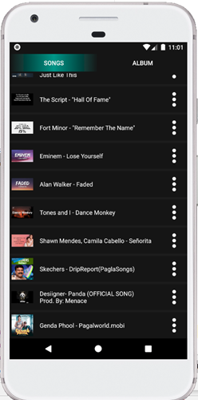
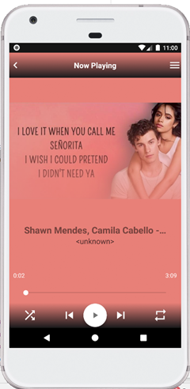
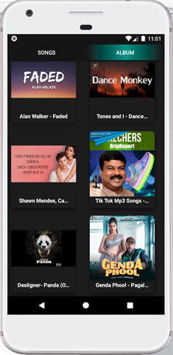

# MusicPlayer

Music player app is a powerful player which helps you listen to all song formats and help you edit music information and optimize them by cutting tool. Music player app supports almost formats of audio files. Following music formats can be playback well: MP3, AAC, MP4, WAV, M4A, FLAC, 3GP, OGG, etc. This music player is also called with other name: mp3 player.Because mp3 format is most popular song format in android.

Music player was designed to bring better experience to user when they listen to music. Music player scans all music automatically and group them by title, artist, album. Easy to find the song you want. Please listen to songs on "Music player" everyday and enjoy the life. It is totally free.

